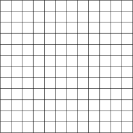
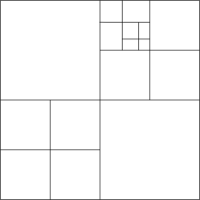
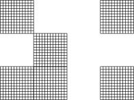

# Voxel

## Types of Voxel

在决定我们使用哪种体素系统前，让我们先了解一下，目前有哪些主流的体素系统，以及哪些最符合我们的需求。

### 1. Flat Array `Cell[N^3]`



```
Cell[WORLD_SIZE^3] g_Voxel;
```

这几乎是最基本的方法，把所有的体素数据 放进一个巨大的flat array。
远古版 Minecraft Classic 和 MCPE 使用了这种方法。

这种方法的有点有：1. constant time random access reads and writes

但也有致命的缺点：1. 世界大小固定 且十分有限 2. 内存占用随着体素体积线性增长  

### 2. `Octree<Cell>`



把每个体素放进SVO Octree。
这种方法看上去很完美，但实际上未必。

虽然这种方法可以按需地做到无限精度，并且空的地方可以不存储任何东西。

但在许多情况下，这种方法比flat array要[慢几个数量级](https://0fps.net/2012/01/14/an-analysis-of-minecraft-like-engines/#:~:text=%C2%A0in%20many%20situations%2C%20they%20turn%20out%20to%20be%20orders%20of%20magnitude%20slower%20than%20flat%20arrays.)。
一种常见的解释是八叉树中邻域查询时间的访问太慢，导致不必要的缓存未命中，并且（重新）分配节点会导致内存碎片。


### 3. Chunks/Paging `Map<vec3, Cell[N^3]> chunks`



<!--
Volume Data             | Mesh Gen              | Physics       | Render        | Description 
---                     | ---                   | ---           | ---           | ---
Uniform Grids + Unary   | Blocky                | Volume Data   | Raster + Mesh | [Minecraft] Blocky, Naive, Non-Scalable
Uniform Grids + Density | Isosurface (SN, MC)   | Mesh          | Raster + Mesh | [Ethertia 2022 Legacy] Smooth, Naive, Non-Scalable
SVO + SDF               | Isosurface (DC, SN, MC) | Mesh        | Raster + Mesh | [VoxelFarm] Smooth, Sharp, Scalable, LoD; <br> [VoxelPlugin] <del>Sharp (DC)</del>
?                       | no                    | Volume Data   | RayMarching + GI | [Teardown] Blocky, Advanced-Physics, Advanced-Render
-->