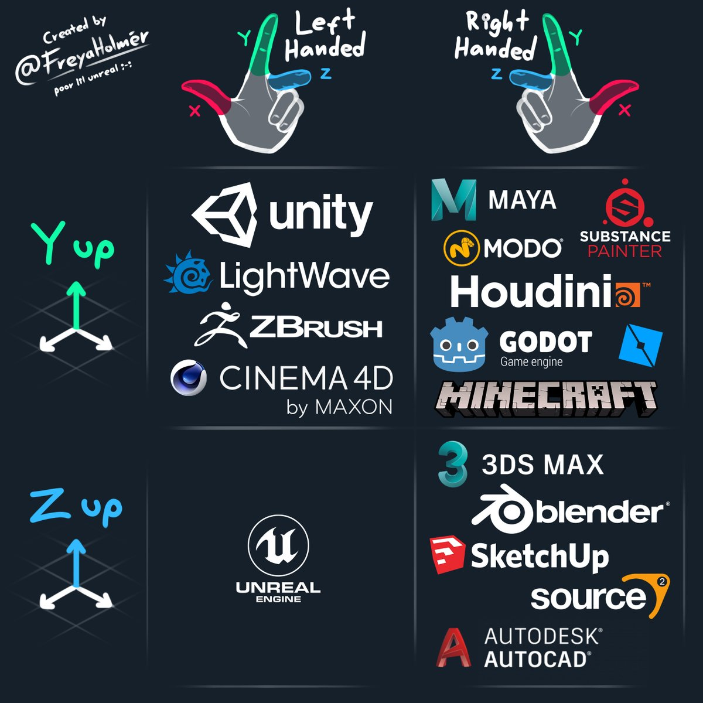
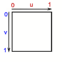

# Conventions

## Naming Conventions

## Coordinate Systems

### World / Render 3D 

We are using `Right-Hand Cartesian Coordinate System` (x: Right, y: Up, z: Back)
in 3D Rendering and World System (Entity, Physics, Chunk..)

::: tip
Although `OpenGL, DirectX, Metal` and `Vulkan (with NegativeY Viewport)`, and `Unity, Unreal` are Left-Hand Coordinate System.  
(OpenGL is internally Left-Handed (after clip-space), but glm::perspective / glOrthof usually generates a negate-z projection matrix)
:::

### UI 2D

| 3D Rendering / World | 2D Texturing |
| -------------        | ---------    |
|  (Z: Backward, RH) |  |