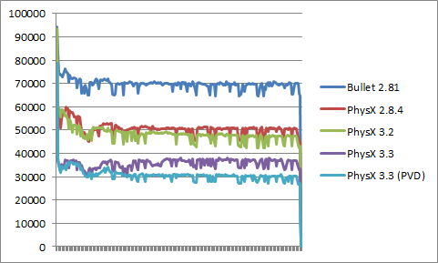

# Physics

我们使用的物理引擎是 PhysX. 

然而
| Physics Engine | Feature |
| --- | --- |
| Bullet3 | |
| ODE | |
| Havok | |

BoxStacks test by [Pierre](http://www.codercorner.com/blog/?p=761)

also "The stability of simulation in stress situations was better in PhysX than in Bullet. Performance wise PhysX was also faster than Bullet." said [Joachim Ante (Unity Technologies)](https://forum.unity.com/threads/why-the-heck-is-almost-every-game-engine-trying-to-switch-over-to-bullet-physics.72731/#:~:text=The%20stability%20of%20simulation%20in,breaking%20backwards%20compatibility%20very%20much.)